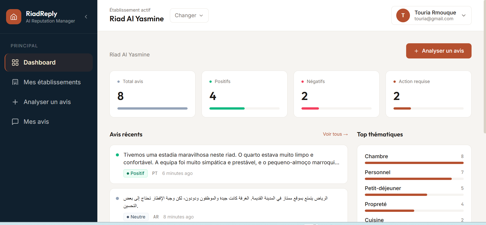

# RiadReply AI

RiadReply AI est une application web développée avec **Laravel 12** permettant aux propriétaires de riads, hôtels et restaurants de centraliser, analyser et répondre intelligemment aux avis clients grâce à l'intelligence artificielle.

<p align="center">
  
</p>

<p align="center">
  
  
  
  
  
</p>

---

## Sommaire

- [Fonctionnalités](#fonctionnalités)
- [Technologies](#technologies)
- [Architecture](#architecture)
- [Installation](#installation)
- [Tests](#tests)
- [API](#api)
- [Sécurité](#sécurité)
- [Bonnes pratiques](#bonnes-pratiques)
- [Aperçu](#aperçu)

---

## Fonctionnalités

### Authentification
- Inscription et connexion sécurisées
- Authentification API avec Laravel Sanctum
- Gestion des tokens d'accès
- Déconnexion
- Profil utilisateur

### Gestion des établissements
- Création d'un établissement
- Modification
- Archivage (Soft Delete)
- Restauration
- Suppression définitive
- Changement d'établissement actif

> Chaque utilisateur peut gérer plusieurs établissements.

### Gestion des avis
- Import manuel d'un avis
- Consultation des avis
- Filtrage
- Consultation d'un avis
- Marquer un avis comme répondu
- Suppression d'un avis

> Chaque avis appartient à l'établissement actuellement sélectionné.

### Intelligence artificielle

Après l'ajout d'un avis :

- Détection automatique de la langue
- Analyse du sentiment
- Génération d'une réponse personnalisée
- Extraction des points importants

> L'analyse est exécutée en arrière-plan grâce aux Jobs Laravel.

### Tableau de bord

Le tableau de bord fournit notamment :

- Nombre total d'avis
- Avis positifs
- Avis négatifs
- Avis neutres
- Avis en attente
- Avis répondus

---

## Technologies

| Catégorie | Stack |
|---|---|
| Framework | Laravel 12, PHP 8.5 |
| Base de données | MySQL |
| Authentification | Laravel Sanctum |
| Traitement asynchrone | Laravel Queues |
| Autorisation | Laravel Policies |
| API | Laravel Resources, Form Requests |
| ORM | Eloquent |
| Frontend | Blade, Tailwind CSS |
| IA | AI Agents (Laravel AI) |

---

## Architecture

```
app/
│
├── Actions/
├── AI/
│   ├── Agents/
│   ├── DTO/
│   ├── Prompts/
│   └── Tools/
│
├── Enums/
├── Http/
│   ├── Controllers/
│   ├── Requests/
│   └── Resources/
│
├── Jobs/
├── Models/
├── Policies/
└── Services/
```

Le projet suit une architecture orientée **Actions**, permettant de séparer la logique métier des contrôleurs.

---

## Installation

### 1. Cloner le projet

```bash
git clone https://github.com/<username>/RiadReplyAi.git
cd RiadReplyAi
```

### 2. Installer les dépendances

```bash
composer install
npm install
```

### 3. Copier le fichier d'environnement

```bash
cp .env.example .env
```

Sous Windows :

```bash
copy .env.example .env
```

### 4. Générer la clé d'application

```bash
php artisan key:generate
```

### 5. Configurer la base de données

Dans le fichier `.env` :

```env
DB_CONNECTION=mysql
DB_HOST=127.0.0.1
DB_PORT=3306
DB_DATABASE=riadreply
DB_USERNAME=root
DB_PASSWORD=
```

### 6. Exécuter les migrations

```bash
php artisan migrate
```

### 7. Lancer le serveur

```bash
php artisan serve
```

### 8. Compiler les assets

```bash
npm run dev
```

---

## Tests

Lancer tous les tests :

```bash
php artisan test
```

Lancer un fichier spécifique :

```bash
php artisan test tests/Feature/Api/AuthTest.php
```

Les tests couvrent :

- Auth API
- Dashboard API
- Establishments API
- Reviews API

---

## API

### Auth

| Méthode | Endpoint |
|---|---|
| POST | `/api/login` |
| POST | `/api/logout` |
| GET | `/api/me` |

### Establishments

| Méthode | Endpoint |
|---|---|
| GET | `/api/establishments` |
| POST | `/api/establishments` |
| GET | `/api/establishments/{id}` |
| PUT | `/api/establishments/{id}` |
| DELETE | `/api/establishments/{id}` |

### Reviews

| Méthode | Endpoint |
|---|---|
| GET | `/api/reviews` |
| POST | `/api/reviews` |
| GET | `/api/reviews/{id}` |
| PATCH | `/api/reviews/{id}/reply` |
| DELETE | `/api/reviews/{id}` |

### Dashboard

| Méthode | Endpoint |
|---|---|
| GET | `/api/dashboard` |

---

## Sécurité

Le projet utilise :

- Laravel Sanctum
- Form Requests
- Policies
- Validation des données
- Protection CSRF (Web)
- Authentification API par token

---

## Bonnes pratiques

- Architecture Action Pattern
- Form Requests
- API Resources
- Enums PHP
- Policies Laravel
- Soft Deletes
- Jobs pour les traitements IA
- Tests Feature
- Code conforme aux conventions Laravel 12

---

## Aperçu

Le projet permet aux propriétaires de :

- Gérer plusieurs établissements
- Centraliser les avis clients
- Analyser automatiquement les sentiments
- Générer des réponses professionnelles grâce à l'IA
- Suivre les statistiques depuis un tableau de bord

---

## Licence

Ce projet est distribué sous licence MIT.